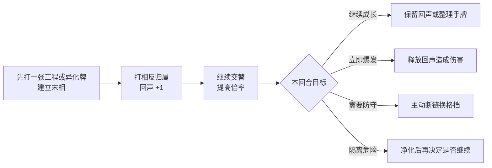

# 《拉莱耶之门》爬塔版本新增内容与沈明流派上手指南

> 更新日期：2026-09-30。本文只记录当前主工程 `D:\Huailxgame1` 已经加入的内容，并用现有卡牌说明五种构筑的基础出牌顺序。本文已经取代旧的“后续方向”“沈明流派设计方案”和“沈明留牌与干扰建议”。

配套的现行资料只保留两份：[第一章路线与卡牌数值](第一章路线与卡牌数值-v0.2-2026-09-30.md)记录房间规则与路线参数，[沈明卡牌分类与数值表](沈明卡牌分类与数值表-v0.1-2026-09-30.md)记录逐张卡牌数值。

## 一、从设计爬塔地图开始新增了什么

1. **随机爬塔路线**：每局按种子生成五列、13个舱段的分叉地图；合法路线约经过11–13间房，路线之间不交叉，终点固定为首领。
2. **竖屏全息地图**：支持滚轮浏览、节点错落排列、图例联动高亮、可选路线发光，以及已走虚线逐渐变成实线。
3. **房间系统**：加入普通战、精英、首领、商店、休整站、药品柜、工具间、维护台、交换台和未知事件。
4. **局内经营**：加入金币、买牌、删牌、饰品、卡牌升级、攻击牌维护强化和带得失的事件选择。
5. **地图与战斗闭环**：选角后进入地图，完成房间后回到原地图继续选路；战斗中可暂停并查看只读地图。
6. **过渡和战斗手感**：加入像素溶解转场、逐张发牌、拖动箭头、中央卡牌预览、攻击与技能的不同出牌动画，以及三种受击音效。
7. **沈明规则**：首回合抽5张，以后每回合新增3张；旧手牌保留；每回合可主动弃2张；结束回合时手牌必须不超过8张。
8. **隔离规则**：隔离值跨回合、跨房间保留；达到10后仍可在当前回合自救，结束回合时仍为10才同化失败。
9. **卡池扩充**：当前有24张基础卡、23张升级卡；除一次性「应急医疗」外都能升级，全部基础卡都有像素卡面。
10. **界面完善**：牌堆、奖励、升级、维护、商店和交换台均显示完整卡面；角色、敌人、状态、意图和异化降费均有可见提示。

## 二、先理解所有流派共用的回声规则

- 第一张工程或异化牌只负责建立“末相”，回声仍为0。
- 之后交替打出 **工程 → 异化 → 工程**，或 **异化 → 工程 → 异化**，每次交替使回声+1。
- 连续打出相同归属会“断链”，回声归零。
- 中立牌不会增加回声，也不会打断回声。
- 沈明可以留牌，因此没有合适的下一张时，可以少出牌，把工程／异化配对留到下回合。

## 三、五种流派成型后怎样出牌

### 1. 闭环回声流：把倍率带到下一回合

**核心牌：** 相位寄存器、冗余缓存、记忆瘤。  
**目标：** 每回合结束保存最多3层回声，下回合从中倍率继续。

**第一次启动：**

`相位寄存器` → 之后按 `工程 → 异化 → 工程` 交替 → 回声至少2层 → 结束回合

相位寄存器只需打出一次，效果在本场战斗持续。若当回合能量不够，先打寄存器完成部署，从下一回合再开始叠回声。

**稳定循环：**

`读取上一回合末相` → 打相反归属 → `记忆瘤`在恢复寄存的回合提供格挡并抽牌 → 继续交替到2–5层 → 结束回合再次寄存

**注意：** 回合结束前不要随意打一张与末相相同的牌，否则会清空准备好的回声。

### 2. 脉冲爆发流：一回合叠高后全部释放

**核心牌：** 超频运转、交叉校准、反相放电；搭配低费异化攻击。  
**目标：** 用额外能量连续交替，最后把回声转成一次高伤害。

**标准爆发顺序：**

`超频运转（工程，能量+2）`  
→ `撕裂或阈值穿刺（异化，回声1）`  
→ `交叉校准（工程，回声2并抽1）`  
→ `另一张异化牌（回声3）`  
→ `反相放电（工程，继续回声并释放全部层数）`

反相放电应放在最后。过早打出会以较少层数释放，之后必须重新叠回声。

### 3. 隔离共生流：在6–9点隔离附近作战

**核心牌：** 阈值穿刺、共生甲壳、抑制剂注入、逻辑锁。  
**目标：** 利用高隔离强化异化牌，再及时降回安全区。

**进入收益区：**

`工程牌` → `撕裂／记忆瘤／共生甲壳` → 继续交替，逐步把隔离提升到6以上

**高隔离循环：**

`阈值穿刺（隔离≥6时高伤害）`  
→ `抑制剂注入（工程，隔离−2/−3并获得格挡）`  
→ `异化牌继续输出或防守`

**紧急退出：**

隔离达到9时优先保留 `逻辑锁` 或 `抑制剂注入`。即使到10也不会立刻死亡，可以先净化；只有按下结束回合时仍为10才失败。

### 4. 手牌编排流：先凑好工程与异化配对

**核心牌：** 预演流程、样本归档、交叉校准，以及各一张工程／异化主力牌。  
**目标：** 利用留牌和换牌，降低抽不到正确归属的概率。

**准备阶段：**

回合结束前保留 `1张工程牌 + 1张异化牌`，主动弃牌优先清理暂时无用的重复牌。

**展开顺序：**

`预演流程（整理下一次抽牌）`  
→ `样本归档（弃1抽2）`  
→ `交叉校准（工程）`  
→ `撕裂／阈值穿刺（异化）`  
→ 按手牌继续工程、异化交替

> 当前测试版的预演流程与样本归档会自动处理最右侧手牌，指定卡牌的选择界面尚未接入；使用前先把希望保留的核心牌移开最右位置。

抽到很多同归属牌时不要全部打掉；留一张到下一回合，通常比当回合强行断链更有价值。

### 5. 断链重启流：主动放弃倍率换防御

**核心牌：** 硬重启；搭配便宜的工程与异化牌。  
**目标：** 敌人即将重击时，主动清空回声并把旧层数转为格挡。

**标准顺序：**

`校准射击（工程，建立末相）`  
→ `撕裂（异化，回声1）`  
→ `交叉校准（工程，回声2）`  
→ `硬重启（再次打工程，主动断链，按旧回声获得格挡）`

**关键判断：** 硬重启必须在“上一张也是工程牌”且已经有回声层数时打出。若上一张是异化牌，硬重启只会正常延续回声，不会获得断链格挡。

## 四、新手构筑时怎样选牌

| 已经拿到的关键牌 | 后续优先寻找 |
|---|---|
| 相位寄存器 | 记忆瘤、冗余缓存、低费交替牌 |
| 反相放电 | 超频运转、交叉校准、低费异化攻击 |
| 阈值穿刺 | 抑制剂注入、逻辑锁、异化防御牌 |
| 预演流程或样本归档 | 工程／异化数量接近的低费牌 |
| 硬重启 | 便宜工程牌、防御不足时的补强牌 |

不必强求整副牌只属于一个流派。先确定一张核心牌，再补启动牌、防御牌和一张失误补救牌，即可形成最初的构筑。
